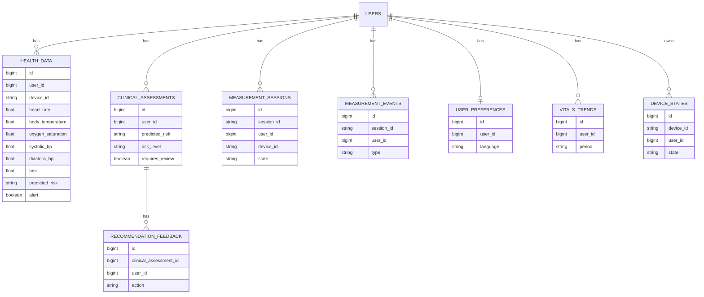

# Database Schema and Storage Architecture

## Scope

This document describes the storage layers for the system: the Laravel database schema, Flutter local storage, the USB bridge token cache, and ML model artifacts.

## Storage Architecture (High-Level)

- Primary system of record: Laravel database (MySQL or PostgreSQL).
- Near-real-time state: Laravel cache tables (optional, if using database cache driver).
- Client-side state: Flutter uses SharedPreferences for auth, cached user, and live data cache.
- USB bridge state: serial listener keeps the latest auth token in a local JSON file.
- ML services: Python services load model artifacts from local files at startup.

## Laravel Database (Core Tables)

### users

- id: bigint, PK
- first_name: string
- last_name: string
- email: string, unique
- email_verified_at: timestamp, nullable
- password: string
- dob: date
- gender: enum('male','female','other')
- weight: decimal(5,2)
- height: decimal(5,2)
- systolic_bp: float(5,2)
- diastolic_bp: float(5,2)
- remember_token: string, nullable
- created_at: timestamp
- updated_at: timestamp

### personal_access_tokens (Laravel Sanctum)

- id: bigint, PK
- tokenable_type: string
- tokenable_id: bigint
- name: text
- token: string(64), unique
- abilities: text, nullable
- last_used_at: timestamp, nullable
- expires_at: timestamp, nullable, indexed
- created_at: timestamp
- updated_at: timestamp

### health_data

- id: bigint, PK
- device_id: string, indexed
- user_id: bigint, FK -> users.id
- heart_rate: float(5,2), nullable
- body_temperature: float(5,2)
- age: integer
- weight_kg: float(6,2)
- height_m: float(4,2)
- gender: string
- bmi: float(5,2)
- systolic_bp: float(5,2)
- diastolic_bp: float(5,2)
- oxygen_saturation: float(5,2)
- pulse_pressure: float(5,2)
- map: float(5,2)
- predicted_risk: string
- probabilities: json, nullable
- alert: boolean, default false
- created_at: timestamp
- updated_at: timestamp

Indexes:

- user_id + created_at
- predicted_risk

### clinical_assessments

- id: bigint, PK
- user_id: bigint, FK -> users.id
- source_endpoint: string(64), default 'health/analysis-v2'
- symptom_key: string(100), nullable
- symptom_label: string(120), nullable
- severity: unsigned tinyint, nullable
- high_risk: boolean, default false
- red_flag_yes: boolean, nullable
- medication_taken_today: string(20), nullable
- known_conditions: json, nullable
- opqrst: json, nullable
- structured_assessment: json, nullable
- ai_success: boolean, nullable
- ai_model: string(100), nullable
- predicted_risk: string(50), nullable
- risk_level: string(20), nullable
- recommendation_excerpt: text, nullable
- structured_response: json, nullable
- language: string(10), default 'english'
- requires_review: boolean, default false
- vitals_snapshot: json, nullable
- created_at: timestamp
- updated_at: timestamp

Indexes:

- user_id + created_at
- user_id + symptom_key

### recommendation_feedback

- id: bigint, PK
- clinical_assessment_id: bigint, FK -> clinical_assessments.id
- user_id: bigint
- action: enum('viewed','dismissed','followed','shared')
- note: text, nullable
- created_at: timestamp
- updated_at: timestamp

Indexes:

- user_id + clinical_assessment_id

### measurement_sessions

- id: bigint, PK
- session_id: string(64), unique
- user_id: bigint, FK -> users.id
- device_id: string(64), indexed
- state: string(40), default 'WAITING_FOR_FINGER'
- started_at: timestamp, nullable
- completed_at: timestamp, nullable
- last_seen_at: timestamp, nullable
- last_progress: unsigned smallint, nullable
- last_error_code: string(80), nullable
- last_live: json, nullable
- last_result: json, nullable
- created_at: timestamp
- updated_at: timestamp

Indexes:

- user_id + created_at
- device_id + state

### measurement_events

- id: bigint, PK
- session_id: string(64), indexed
- user_id: bigint, FK -> users.id
- device_id: string(64), indexed
- type: string(32), indexed
- payload: json, nullable
- captured_at: timestamp, nullable
- created_at: timestamp
- updated_at: timestamp

Indexes:

- user_id + created_at

Note: session_id is a string identifier; it is not a foreign key.

### device_states

- id: bigint, PK
- device_id: string(64), unique
- user_id: bigint, nullable, FK -> users.id (null on delete)
- last_session_id: string(64), nullable
- state: string(40), nullable
- last_seen_at: timestamp, nullable
- last_error_code: string(80), nullable
- last_payload: json, nullable
- created_at: timestamp
- updated_at: timestamp

### user_preferences

- id: bigint, PK
- user_id: bigint, unique, FK -> users.id
- language: string(10), default 'english'
- notifications_enabled: boolean, default true
- share_token: string(64), nullable, unique
- created_at: timestamp
- updated_at: timestamp

### vitals_trends

- id: bigint, PK
- user_id: bigint, indexed
- period: string(10), default '30r'
- metrics: json
- computed_at: timestamp
- created_at: timestamp
- updated_at: timestamp

Indexes:

- unique(user_id, period)

### cache (optional if DB cache driver is used)

- key: string, PK
- value: mediumtext
- expiration: integer

### cache_locks

- key: string, PK
- owner: string
- expiration: integer

### jobs / job_batches / failed_jobs (Laravel queue tables)

- jobs: id, queue, payload, attempts, reserved_at, available_at, created_at
- job_batches: id, name, total_jobs, pending_jobs, failed_jobs, failed_job_ids, options, cancelled_at, created_at, finished_at
- failed_jobs: id, uuid, connection, queue, payload, exception, failed_at

## Relationships (ER Overview)

## Flutter Local Storage (SharedPreferences)

Stored on-device using `shared_preferences`.

- auth_token: string (Sanctum token)
- cached_user: string (JSON payload of the current user)
- biometric_enabled: bool
- live*cache_v1*{user_id}: string (JSON payload containing cached vitals, analysis, live state, and metrics)

## USB Bridge (Python serial listener)

- last_token.json: file path defined by `TOKEN_CACHE_PATH` (default: last_token.json)
  - Stores the current Sanctum token so the USB bridge can authenticate sensor uploads.

## ML Model Artifacts

### model_service.py (risk prediction)

- rf_risk_model.pkl
- scaler.pkl
- label_encoder_risk.pkl

### feedback_service.py (clinical report)

- clinical_risk_model.pkl
- risk_encoder.pkl
- shap_explainer.pkl

## Notes and Constraints

- measurement_events.session_id is a string identifier and is not a foreign key to measurement_sessions.
- health_data uses user_id + created_at indexes for dashboard queries and predicted_risk index for filtering.
- clinical_assessments keeps both the input context and AI output (structured_response, recommendation_excerpt).
- device_states user_id is nullable and uses null-on-delete behavior.
