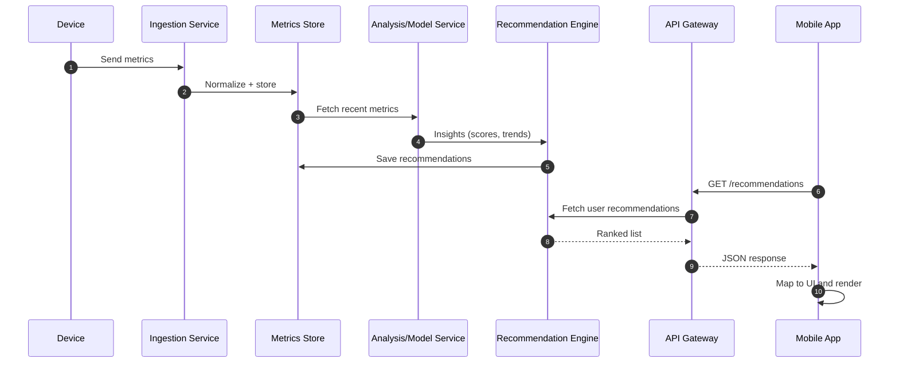

# Recommendation Screen System-Level Description

## Overview

The recommendation screen presents personalized guidance to the user based on recent health data and analysis outputs. The data originates from device ingestion and analytics services, is processed by the backend, and is then delivered to the mobile app through a secure API. The mobile app renders the recommendation list, priority badges, and action hints while handling offline and loading states.

## Key Components

- Data sources: device metrics, user profile data, and computed analytics.
- Backend services: ingestion, analysis/modeling, recommendation orchestration, and API gateway.
- Storage: time-series metrics, user profile, and recommendation cache.
- Mobile app: state management, API client, UI rendering, and local cache.

## Backend to Mobile Flow (System-Level)

1. Device metrics are captured and sent to the ingestion service.
2. Metrics are normalized and stored in the metrics datastore.
3. Analysis/model service computes health insights (risk scores, trends).
4. Recommendation engine combines insights with user profile and rules.
5. Generated recommendations are stored and cached per user.
6. Mobile app requests recommendations via the API gateway.
7. Backend returns a ranked list with metadata (title, summary, tags, priority, confidence, timestamp).
8. Mobile app maps the response to UI models and renders the recommendation screen.
9. User actions (view, dismiss, follow-up) are optionally sent back for feedback.

## Data Contract (Illustrative)

```json
{
  "user_id": "u_123",
  "generated_at": "2026-05-24T08:15:00Z",
  "items": [
    {
      "id": "rec_001",
      "title": "Increase daily walking",
      "summary": "Your activity dropped 18% this week. Aim for 6,000 steps/day.",
      "priority": "high",
      "tags": ["activity", "cardio"],
      "confidence": 0.82,
      "cta": {
        "label": "View plan",
        "route": "activity_plan"
      }
    }
  ]
}
```

## Mobile Screen Rendering Notes

- Sort by priority then confidence.
- Display badges for priority and tags.
- Show a generated timestamp and a refresh control.
- Cache the last successful response for offline access.

## Error and Edge Handling

- If the API returns empty results, show a friendly empty state with a refresh button.
- If the request fails, show a retry state and fallback to cached data if available.
- Guard against partial items (missing title/summary) with placeholder text.

## Sequence Diagram


